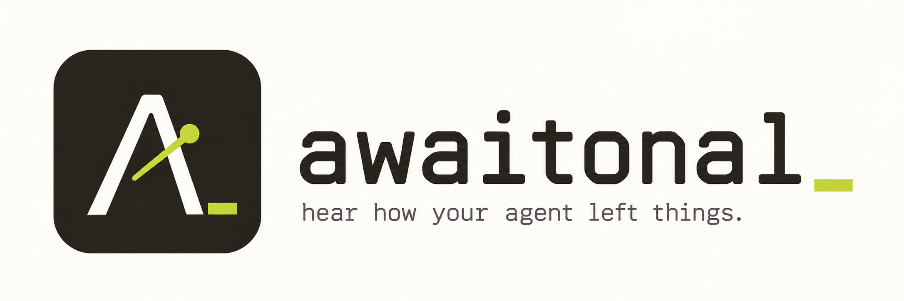

# Awaitonal



**Hear how your agent left things.**

Awaitonal turns your coding agent's final reply into a short musical cue. Hear
whether it completed a change, answered a question, delivered an artifact, or
needs your attention. Classification and sound synthesis run locally.

Each cue describes what the agent reports; it does not verify the work. Awaitonal
selects from composed phrases and keeps response text on your machine.

Connect [Claude Code](#connect-claude-code), [local Codex sessions](#connect-codex),
or [Pi](#connect-pi).

## Hear it

Requires Python 3.11+ and [uv](https://docs.astral.sh/uv/). Audio playback currently
uses macOS's built-in `afplay`. Rendering, classification, and tests require no
audio device. NumPy is the only core runtime dependency.

From the repository root:

```sh
uv sync --dev
uv run awaitonal demo
uv run awaitonal demo --out palette.wav
uv run awaitonal play done
uv run awaitonal play review
uv run awaitonal play needs-you
uv run awaitonal play answer --long-turn
```

Use `play` with any gesture ID below. Both `demo` and `play` accept `--out` to save
a WAV without playback, and neither requires a running service or classifier.
The [palette demo](artifacts/awaitonal-palette.wav) plays these gestures in order,
with 350 ms gaps. Durations below use the default voice.

| Gesture ID | Meaning and sound | Default duration |
| --- | --- | --- |
| `done` | Reported completion: descending notes settle into a chord | 1.08 s |
| `answer` | Answer or finding: a quick upward figure | 0.95 s |
| `plan` | Plan or proposal: four measured steps | 1.10 s |
| `artifact` | Output ready to inspect: an arpeggio blooms | 1.12 s |
| `published` | Result delivered externally: two broad chord strikes | 1.12 s |
| `review` | Feedback requested: a suspended opening and hanging A4 → B4 | 1.52 s |
| `decision` | Required choice or clarification: taps and a rising question | 1.13 s |
| `needs-you` | Sign-in, approval, or needed action: knocks, a pause, then A4 → B4 | 1.82 s |
| `caveats` | Partial result or limitation: an unresolved descent | 1.10 s |
| `rejected` | Refusal: two dry C4–F♯4 taps | 0.66 s |
| `failed` | API or infrastructure failure: three low, descending two-note pulses | 1.02 s |
| `verdict` | Completed assessment: a compact, firm ending | 0.98 s |
| `in-flight` | Continuing work: a quiet, unresolved pulse; silent by default | 0.54 s |
| `authorization` | Prepared publication or other outward action awaits approval: an expectant tail | 1.38 s |

In-flight notifications are silent by default; `play` and `demo` let you hear
them. Each audible notification plays one gesture once.

Live `answer` and `done` cues use lighter arrangements for turns under two minutes
and fuller arrangements for longer turns. Repeated outcomes alternate between
two arrangements within that timing group; missing timing uses the original cue.
Each session's instrument stays stable. The table and existing demos describe
the original arrangement.
Try `awaitonal play answer --voice marimba --variation 2`, or see the
[variation listening comparison and settings](docs/gesture-variations.md).

### Parallel sessions

Six voices rotate across new sessions: **marimba, powersaw brass, harp, clarinet,
crystal key, and flute**. A returning session keeps its instrument until an hour
of inactivity or a service restart. New sessions get unused voices first; beyond
six active sessions, voices are shared. Playback stays serial.

```sh
uv run awaitonal play review --voice powersaw
uv run awaitonal ensemble-demo --mode rotation --out rotation.wav
```

Enable this with `session_voices = true` in the service configuration's
`[notifications]` table. The six voices use shorter note tails than the default
voice, with soft attacks and shared tuning. Choose their order or a smaller set
with `voice_cycle`. See [session voices and listening comparisons](docs/session-voices.md).

### Customize the sound

All sound settings live in [palette.toml](src/awaitonal/palette.toml): pitches,
timing, envelopes, harmonics, gain, and headroom. The same file holds the routing
threshold and notification settings. Pass `--config my-palette.toml` to `demo`,
`play`, `ensemble-demo`, `classify`, or `serve` to override selected values.
Tables merge with the defaults; event arrays replace a state's entire event list.
For example:

```toml
[synth]
master_gain = 0.18

[synth.brightness]
enabled = true
```

Brightness is off by default. When enabled, longer responses gradually strengthen
upper harmonics, up to a fixed limit. This leaves duration unchanged and matches
the original gesture's energy, subject to peak limiting. Chord normalization
keeps richer chords from becoming louder. Synthesis is deterministic, omits
partials above Nyquist, and uses smooth attacks and releases. WAV output is mono
PCM16 at 48 kHz by default.

The palette has been revised through listening feedback. Recognition of its cues
has not been measured in a blinded study.

## Classify and run

```sh
uv run awaitonal classify --text "Done. Integration tests were unavailable." --json
uv run awaitonal classify --text "Please review the draft and tell me what you think." --json
uv run awaitonal classify --text "Please complete SSO sign-in so I can continue." --json
uv run awaitonal serve --classifier rules
```

For a managed background process, use:

```sh
uv run awaitonal service start
uv run awaitonal service status
uv run awaitonal service mute
uv run awaitonal service unmute
uv run awaitonal doctor
uv run awaitonal service stop
```

On macOS, `awaitonal service install` enables a service that starts when you log
in; `awaitonal service uninstall` removes it. Use a stable installed executable,
such as the plugin runtime below, before enabling login startup. `serve` runs in
the foreground; Ctrl-C stops it. With either service mode running, send a test
notification from another terminal:

```sh
uv run awaitonal notify --text "Which database should I use before proceeding?"
```

`notify` reports an error if the service is absent. Normal hooks return quietly
instead. `serve --silent` runs classification and diagnostics without audio.
Setup is explicit: notification hooks never install dependencies or start the
service. The listener is private to your user account.

**Mute applies to every session sharing the service.** `service mute` keeps the
process and any model loaded, discards queued notifications, and allows a cue
already starting or playing to finish. `service unmute` resumes future
notifications without replaying missed ones. Mute lasts until unmuted or the
service restarts; `service status` and `doctor` report it.

### Classification

The core controls are `loose_ends` in [0, 1], `needs_you`, `rejected`, and `failed`.
Known outcomes route deterministically: rejection, waiting, failure, then caveats
at or above the configured threshold (0.5 by default), otherwise done. Text
classifiers assign coarse loose-end values of 0 or 1; these are not probabilities.

Text outcomes are `done`, `caveats`, `needs-you`, `rejected`, and `unknown`.
Structured infrastructure errors add `failed`. `unknown` preserves uncertainty
and uses the neutral `answer` cue. Classification also returns `delivery_kind`,
`expectancy`, `handoff_kind`, `assessment_kind`, `activity`, and `gesture`.
Playback uses `gesture`; queue priority uses the outcome.

A request for feedback gets `review-requested` and a softer cue. Required sign-in,
approval, choices, and evidence get `required-handoff`. Structured question and
permission events bypass textual inference.

Rules examine the assistant's current prose, filtering Markdown code and quotes
where practical. They distinguish a direct request for review from passive
availability, current sign-in requests from documented login steps, and unfinished
work from a completed diagnosis of a problem. Optional offers do not imply
waiting; recovered failures do not imply refusal. Artifact and PR links need
current delivery wording. A verdict needs an assessment frame or assessed object,
and ongoing work is distinct from a future plan.

Unclear prose retains `state = "unknown"`; empty or code-only input and malformed
events are ignored. The rules are English-language heuristics, and the classifier
sees only the final response. Without the preceding request, task scope and
implicit dependencies can remain ambiguous. See [routing details and examples](docs/gesture-routing.md).

### Transport and playback

The listener uses a private Unix socket at `/tmp/awaitonal-<uid>/service.sock`,
with a 0700 directory, a 0600 socket, and a single-instance lock. Override it with
`--socket PATH` on service, client, or hook commands, or with `AWAITONAL_SOCKET`.
A custom parent directory must also be owned by you and have mode 0700.

Hook input is capped at 64 KiB and 150 ms. Before sending response text, the client
checks directory and socket permissions, ownership, and the connected peer's user
ID. Symlinked endpoints and untrusted listeners are rejected; normal hooks discard
those notifications silently. This boundary separates OS users, not processes
under your own account. Connecting and sending have an 80 ms total deadline.
The hook never waits for classification or playback. These are I/O bounds, not
guarantees about OS process-start latency.

The default queue holds eight events, drops notifications older than eight seconds,
coalesces obsolete events, and favors attention over routine completion. Duplicate
suppression lasts two seconds and includes session and available turn IDs. On
older Claude versions without prompt IDs, rapid identical turns cannot always be
distinguished, but suppression is never permanent.

No queue or response text is persisted. Default service logs contain outcome and
gesture metadata, evidence sources, timings, and error class names. Review requests
have routine priority; required handoffs and refusals have attention priority.
Longer cues can increase delay during bursts.

## Turn timing and background work

These optional settings work with the resident service:

```toml
[notifications]
min_turn_seconds = 30
long_turn_seconds = 120
notify_in_flight = false
```

Pass the file with `serve --config PATH` or `service start --config PATH`.
Suppression and extended endings default to zero (disabled); the background pulse
defaults to false. Short-turn suppression affects routine results only. Handoffs, feedback
requests, caveats, refusals, and failures remain audible.

The [lighter/full arrangements for answer and done](docs/gesture-variations.md)
are enabled separately, with a default cutoff of 120 seconds. They do not require
suppression or extended endings to be enabled.

Long-turn variants give `done`, `answer`, `verdict`, `plan`, `artifact`, and
`published` a longer, slightly more triumphant finish. The default and original
voices add 0.8 seconds: two rising notes and a wider, held ending. The six compact
session voices keep the extra notes but use a shorter final chord, adding 0.36
seconds. With session voices enabled, a waiting notification from another session
suppresses the extension. Preview with `awaitonal play verdict --long-turn`.
The in-flight pulse is independent of timing.

Timing measures elapsed turn time, **not model thinking duration**. It requires
matching start and stop IDs: Claude's `prompt_id` (2.1.196+), Codex's
`turn_id`, or Pi's extension-generated activity ID. Missing or
ambiguous timing leaves ordinary playback intact. Autonomous follow-ups cannot
inherit an old wait, and restarting the service clears its in-memory timing map.

Stop metadata contributes only bounded background-task and scheduled-task counts.
Commands, task descriptions, and scheduled prompts are discarded. Counts can
corroborate a reply that says work is ongoing; a background monitor alone does not
turn a completed result into a waiting cue. No hook is added to every tool call.

## Connect Claude Code

The plugin and its marketplace both live in this repository:

```sh
claude plugin marketplace add sindarknave/awaitonal
claude plugin install awaitonal@awaitonal
```

Restart Claude Code, then run `/awaitonal:setup` to install the runtime and start
the service. `/awaitonal:status` diagnoses setup. Use `/awaitonal:mute` and
`/awaitonal:unmute` to silence or resume sounds for all sessions sharing the service.
`/awaitonal:uninstall` removes the plugin-owned runtime.

After updating the plugin, restart Claude Code and rerun setup to update its
stable Python runtime. See [plugin setup, updates, and migration](docs/plugin.md),
including how to remove old manual hooks without duplicate sounds.

For a standalone installation, `awaitonal init` previews the settings diff;
`awaitonal init --apply` backs up settings and installs owned handlers.
`awaitonal uninstall --apply` removes only those handlers. Both accept
`--settings PATH` for an explicit Claude settings file. Migrating old hand-pasted
snippets requires `--legacy-executable /absolute/path/to/awaitonal`.

### Hook behavior

Compatibility was checked against Claude Code **2.1.158** and the
[official hook reference](https://code.claude.com/docs/en/hooks) in September 2026.
The adapter handles:

- `Stop`: classify `last_assistant_message` when supplied; stopping alone does not establish success.
- `PreToolUse` matched to `AskUserQuestion`: select `needs-you` with the `decision` gesture.
- `PermissionRequest`: select `needs-you` with the stronger waiting gesture.
- `StopFailure`: use a structured error code; account or authentication problems need user action, while other errors play `failed`. Error prose is discarded.
- `UserPromptSubmit`: retain timing metadata and discard prompt text.

Events with `agent_id` are suppressed as subagent events; there is no `SubagentStop`
hook. Missing final text is ignored, and transcripts are never opened. `prompt_id`
is used when present; it requires Claude 2.1.196+ and was absent in the tested
2.1.158 schema. See [compatibility details](docs/claude-hooks.md).

```sh
uv run awaitonal hook claude --dry-run < examples/claude-stop.json
uv run awaitonal hook claude --dry-run < examples/claude-question.json
uv run awaitonal hook claude < examples/claude-stop.json
```

Normal hooks produce no stdout or stderr and exit 0 even for invalid input or a
missing service. They emit no permissions, decisions, prompts, or feedback.
`--dry-run` is diagnostic and must never appear in installed hooks. Hooks use a
short synchronous handoff; the resident service does the work separately.

### Manual hook configuration

To generate a settings fragment instead of using `init`:

```sh
uv run awaitonal hook-config > examples/claude-hooks.local.json
```

The fragment uses the installed executable's absolute, shell-quoted path, so it
works from another project. Review it, then merge its five groups into your
chosen Claude settings file's `hooks` object, preserving existing settings.
Regenerate it after moving the checkout or environment. The generated file is
excluded from version control and packages. A [portable template](examples/claude-hooks.template.json)
and [installation and removal guide](docs/claude-hooks.md) are included.

## Connect Codex

Awaitonal also supports local Codex sessions with native lifecycle hooks. From
this checkout, install the package, start the shared service, and preview the hooks:

```sh
uv sync --dev
uv run awaitonal service start
uv run awaitonal init --adapter codex
uv run awaitonal init --adapter codex --apply
```

Open `/hooks` in Codex CLI to review and trust the new hooks. Codex skips
untrusted hooks, including those bundled in plugins. Restart or open a new
session after changing the installation. The [plugin guide](docs/plugin.md)
also covers Codex packaging and setup skills. Codex plugin setup installs these
same tracked user hooks; it does not depend on bundled-hook discovery.

Setup writes `hooks.json` under `CODEX_HOME` (default `~/.codex`), backs up existing
content, and preserves unrelated hooks. Use `--settings PATH` for a specific JSON
hook file. `awaitonal uninstall --adapter codex --apply` removes only its tracked
Codex handlers; Claude's settings are separate.

Codex `Stop` supplies final text to the same classifier. `UserPromptSubmit`
starts turn timing, `PermissionRequest` plays the approval cue, and
`PreToolUse` for `request_user_input` or `request_user_input_async` plays the
decision cue. No transcript is read. Missing final text, subagent events, and
unsupported events are ignored. Codex has no documented `StopFailure` equivalent,
so structured API-error notifications are available through Claude and Pi.

All three agents share the warm service, palette, and voice rotation. Codex session
IDs are namespaced to keep their turn timing and voices independent of Claude
sessions. Mute affects **all three** when they use the same service. Remote or cloud
execution cannot play through your Mac's local socket without a separate bridge.

```sh
uv run awaitonal hook codex --dry-run < examples/codex-stop.json
uv run awaitonal hook codex --dry-run < examples/codex-question.json
uv run awaitonal doctor --adapter codex
```

Doctor checks the service and manual hooks in the selected JSON file. It reports
Codex hook trust as unknown; use Codex's `/hooks` to inspect trust, plugin hooks,
and inline TOML hooks across all scopes. See [Codex compatibility and fixtures](docs/codex-hooks.md).

## Connect Pi

The repository is also a [Pi package](https://github.com/earendil-works/pi).
Use Pi 0.87.1 or newer and install the release:

```sh
pi install git:github.com/sindarknave/awaitonal@v0.7.0
```

For local development, use `pi install /absolute/path/to/awaitonal` instead.

Start Pi or run `/reload`, then run `/awaitonal-setup`. Setup installs the shared
Python runtime and starts its service. `/awaitonal-status`, `/awaitonal-mute`,
and `/awaitonal-unmute` inspect and control that service. Mute applies to Claude,
Codex, and Pi sessions together.

The extension waits for Pi's `agent_settled` event after automatic retries,
compaction, and queued continuations. It classifies the final assistant text,
announces blocking extension dialogs during an active run, and plays `failed`
for a terminal error. Canceled runs end quietly. Thinking, tool output, user
prompts, and error details are not sent to Awaitonal.

Pi sessions get their own identities for timing and rotating voices. Pi manages
extension registration; no Claude-style hook settings are written. See
[Pi setup, commands, and limitations](docs/pi.md), including standalone runtime
configuration and removal.

## Optional local embeddings

**Experimental. Start with rules.** Both backends share explicit delivery and
handoff rules. The semantic backend uses recognized routes first
(`diagnostics.backend = "rules-routing"`), then falls back to its original
four-outcome embedding comparison for unrecognized prose. It loads local model
weights once at service startup.

The original v0.1 encoder scored 13/30 on the included fixtures. A later exploratory
sample of real conversations exposed substantial errors in both backends. These
historical scores do not describe the current router, and the fixtures are now
regression material rather than a fresh accuracy estimate. The original
[encoder results](artifacts/evaluation-semantic.json) remain available.

Install optional dependencies, then explicitly download weights once:

```sh
uv sync --dev --extra semantic
uv run --extra semantic awaitonal model-setup --model-dir .models/all-MiniLM-L6-v2
```

The model is [`sentence-transformers/all-MiniLM-L6-v2`](https://huggingface.co/sentence-transformers/all-MiniLM-L6-v2),
distributed under Apache-2.0 by the Sentence Transformers project. It produces
384-dimensional sentence embeddings and has a default context window of 256 word
pieces. Awaitonal uses PyTorch on CPU with `trust_remote_code=False`; see the
[Sentence Transformers documentation](https://sbert.net/docs/sentence_transformer/usage/efficiency.html)
for runtime options. Sentence Transformers, Transformers, and PyTorch are optional;
rules, hooks, demos, and rendering do not need them.

After setup, use the installed environment directly for offline startup:

```sh
HF_HUB_OFFLINE=1 TRANSFORMERS_OFFLINE=1 .venv/bin/awaitonal serve \
  --classifier semantic --model-dir .models/all-MiniLM-L6-v2

HF_HUB_OFFLINE=1 TRANSFORMERS_OFFLINE=1 .venv/bin/awaitonal classify \
  --classifier semantic --model-dir .models/all-MiniLM-L6-v2 \
  --text "I need your approval before continuing." --json
```

The constructor requires a local model directory and uses `local_files_only=True`.
Missing weights produce a setup error. The service loads the model and embeds
anchors once, keeping both ready for subsequent requests. Hooks never download
models or import ML libraries. Without `--model-dir`, the default location is
`~/.cache/awaitonal/all-MiniLM-L6-v2`, overridable with `AWAITONAL_MODEL_DIR`.

Edit [anchors.json](src/awaitonal/anchors.json) to change the positive and negative
examples for each class. These are separate from the [evaluation fixtures](examples/evaluation.jsonl).
[semantic.toml](src/awaitonal/semantic.toml) controls thresholds and margins;
`--semantic-config PATH` overrides it. Its `anchors` path is relative to that file.

The backend tokenizes without truncation, reserves conclusion windows, selects
salient passages with nearby recovery clauses, then fills remaining slots with
coverage windows. Each window is checked against the encoder's word-piece limit.
By default, selection is capped at eight windows of 224 tokens; diagnostics report
omitted-token counts. The backend does not embed an entire transcript.

For each class, a window score combines 75% best-anchor similarity with 25% mean
similarity to the top three anchors. The class score combines 65% conclusion score
with 35% strongest-window score. The winner must clear an absolute threshold and
a runner-up margin. Attention and rejection use stricter thresholds and margins
over negative anchors. Uncertain results retain `unknown` and use the neutral
answer cue. Cosine similarity measures resemblance to examples, not probability
or whether the agent's work is correct.

## Tests, evaluation, and timings

Run the core checks without ML weights or an audio device:

```sh
uv sync --dev
HF_HUB_OFFLINE=1 TRANSFORMERS_OFFLINE=1 .venv/bin/python -m pytest -q
.venv/bin/awaitonal evaluate --classifier rules
.venv/bin/awaitonal evaluate --fixtures examples/gesture-evaluation.jsonl
.venv/bin/awaitonal evaluate --fixtures examples/classification-vNext.jsonl
.venv/bin/awaitonal evaluate --fixtures examples/classification-v061.jsonl
.venv/bin/python tools/benchmark.py
node --experimental-strip-types --test tests/pi-extension.test.mjs
```

Evaluation fixtures ship with the source distribution. Run from the checkout,
or pass `--fixtures PATH` when using an installed wheel.
The Pi extension tests use Node.js 22.19+ and need no npm dependencies or model calls.

After setting up the optional semantic model:

```sh
HF_HUB_OFFLINE=1 TRANSFORMERS_OFFLINE=1 \
  AWAITONAL_TEST_MODEL="$PWD/.models/all-MiniLM-L6-v2" \
  .venv/bin/python -m pytest -q

HF_HUB_OFFLINE=1 TRANSFORMERS_OFFLINE=1 .venv/bin/awaitonal evaluate \
  --classifier semantic --model-dir .models/all-MiniLM-L6-v2

HF_HUB_OFFLINE=1 TRANSFORMERS_OFFLINE=1 .venv/bin/python tools/benchmark.py \
  --model-dir .models/all-MiniLM-L6-v2
```

Tests cover routing, prose contrasts, model input limits, explicit events,
malformed input, quiet hooks, blocked stdin, unavailable services, concurrent
sessions, bounded queues, duplicates, shutdown, and audio properties. Real-model
tests run only when dependencies and weights are available, and the model-loading
test blocks network connections. Stubbed encoder tests do not establish model quality.

Gesture fixtures are authored development examples, including direct versus passive
review, active versus documented authentication, delivery types, and explicit states.
Gesture, expectancy, delivery, activity, assessment, and handoff labels have separate
evaluation totals and confusion matrices. Reports also identify false caveats,
missed handoffs, and unknown outcomes. A correct outcome alone does not count as a
correct gesture. Evaluation output contains IDs and labels, without response text.

The [latest rules comparison](docs/classification-v061-evaluation.md) includes 16
targeted regressions and 92 eligible public replies labeled before predictions.
The targeted cases improve; public-sample scores remain unchanged. The report
includes label ambiguity, remaining gaps, and classifier-only latency on a MacBook.

[VALIDATION.md](VALIDATION.md) records observed test runs, audio properties,
classification results, timings, and remaining gaps. Benchmarks separate fresh
process launches, warm classification, and socket handoff; semantic measurements
also distinguish shared-rule routing from encoder fallback. Cache state and OS
scheduling are uncontrolled, so these measurements are not latency guarantees.

## Mute, disable, or remove

- **Mute temporarily:** use `/awaitonal:mute` in Claude, `/awaitonal-mute` in Pi,
  or `awaitonal service mute`.
  Resume with the matching `unmute` command. This affects all sessions sharing
  the service.
- **Stop playback:** stop a foreground service with Ctrl-C, or a managed service
  with `awaitonal service stop`. Use the plugin runtime's service wrapper for a
  plugin installation.
- **Remove the Claude plugin and runtime:** use `/awaitonal:uninstall`. See the
  [plugin removal guide](docs/plugin.md#disable-or-remove) for disabling hooks or
  removing a runtime after its plugin has already been removed.
- **Remove standalone hooks:** run `awaitonal uninstall --apply` for Claude or
  `awaitonal uninstall --adapter codex --apply` for Codex. Remove any
  untracked, hand-pasted Awaitonal handlers manually, preserving unrelated hooks.
- **Remove the Pi extension:** run `pi remove git:github.com/sindarknave/awaitonal@v0.7.0`,
  or `pi remove /absolute/path/to/awaitonal` for a local installation, then `/reload`
  or restart Pi. Use the same source you installed; the shared service stays available.
- **Remove automatic startup:** if you enabled it, run `awaitonal service uninstall`.
  Then stop the service and remove its installed environment or checkout when no
  longer needed. Optional downloaded model weights can be removed separately.

Setup and login startup are explicit actions. An empty lock file may remain in
the private socket directory; remove it only after the service has stopped.

## Code map

- `adapter.py`, `client.py`: event adaptation and quiet hook handoff.
- `extensions/pi.ts`, `package.json`: Pi lifecycle extension and package registration.
- `text.py`, `classify.py`, `semantic.py`: prose extraction and outcome classification.
- `delivery.py`, `handoff.py`: reported delivery and requested human participation.
- `types.py`: classification controls and deterministic state mapping.
- `palette.toml`, `config.py`, `synth.py`, `playback.py`: configuration, synthesis, and local audio.
- `voices.py`, `variations.py`, `audition.py`: session instruments, duration-based arrangements, and listening comparisons.
- `service.py`, `cli.py`: serial worker, private socket, and commands.
- `evaluation.py`, `tools/benchmark.py`: evaluation and timing measurements.

Claude Code, local Codex, and Pi are supported through separate adapters. Awaitonal
itself needs no cloud account, API key, or GPU. Plugins and the managed service
are installed explicitly.

## License

Awaitonal's code, documentation, and included audio assets are available under
the [MIT License](LICENSE). Third-party dependencies and optional model weights
retain their own licenses.
